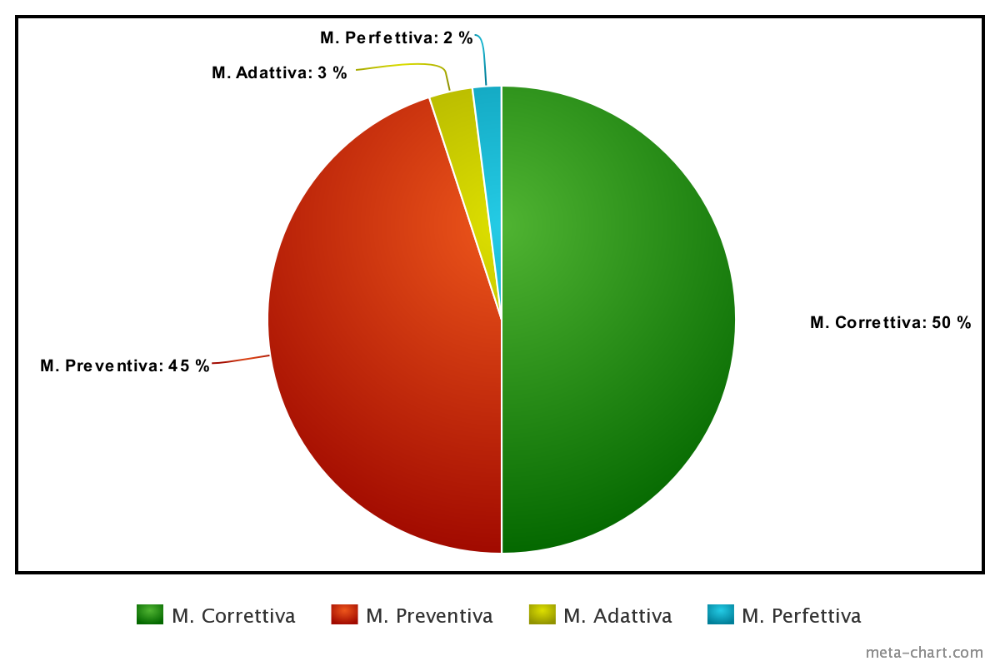

# Manutenzione
Software maintenance is an important process to ensure that it functions correctly and continuously meets user needs. There are different types of software maintenance: **corrective** (bug removal, etc.), **adaptive** (adapting to changes in the software's operating environment), **perfective** (responding to new user requests/requirements, performance improvements, etc.), and **preventive** (improving future maintainability).

In our case, the software was not developed on request but according to the COTS (Commercial Off The Shelf) paradigm. Therefore, any perfective maintenance, if performed, would be due to changes in the market and implicit needs of the community, rather than an explicit request from the client.

As per the definition, in our case as well, the maintenance phase started immediately after the delivery of the application and will last throughout its useful life. It is estimated that this phase will require 20 hours per month per team member. So far, it has primarily involved corrective and preventive maintenance: since the system has been in operation for a short time, there haven't been any significant changes in the environment or market demands yet. However, we do not rule out the possibility that in the future, our program may be required to do more.

The team spends part of their time both using the application to find bugs or improperly implemented functionalities and analyzing the code to identify bad smells. In particular, the team considers the following priorities above all others for elimination:

- Improper use of class hierarchy
- Lack of comments
- Incorrect indentation, which makes JSX code unreadable

To ensure efficient and high-quality maintenance, it is important to follow a set of best practices. In our case, these practices include:

- Documentation: Maintaining detailed documentation of the software, including requirements, design, and source code.
- Monitoring: Using monitoring tools to identify any issues and prevent future problems.
- Updates: Regularly applying security updates and addressing any security issues.
- Testing: Conducting regular software testing to verify proper functionality and meet user needs.
