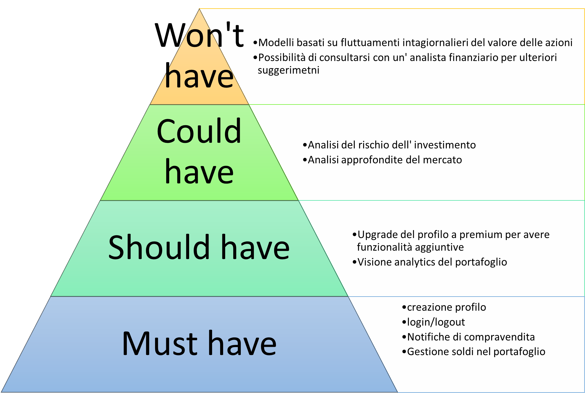

# Requirement Engineering

Requirement engineering is an important phase of a software project. Our goal was to obtain a complete description of the problem to be solved. The outcome of this phase is the specification of requirements, which describes the main requirements of the platform, ordered by priority.

## Requirements Specification

### 1. Introduction

#### Purposes
The purpose of this document is to specify the requirements of the software system to facilitate its realization. In this regard, we adhere to the IEEE830 guidelines.

#### Objectives
The objective is to create a platform for algorithmic trading. Users can load funds for investment. The system sends notifications to the users about when to invest or sell based on market trends. With a simple click, users can approve the suggested transactions by the platform. The project's goal is the automatic management of user portfolios, specifically the notifications for buying/selling stocks based on trends.

#### Definitions, Acronyms, and Abbreviations
- STOCK: Stock value
- STOCK_NAME: Company name
- STOCK_CLOSE: Stock value at market closing.

### 2. General Description

#### Product Functionality
- Registration and profile creation
- Login/logout
- Adding funds
- Withdrawing funds
- Profile update
- Authorization for buying/selling
- Investment and portfolio analysis

#### User Characteristics
The software system is aimed at users with a fair knowledge of the field of information technology, although no knowledge of finance and trading is required. However, users are expected to be aware of personal finance and money management.

#### General Constraints

### 3. Specific Requirements

#### User Interface
The software system should have an intuitive, simple, and clear interface.

#### Hardware Interface
The system should not interface with any hardware systems.

### Functional Requirements

In this regard, we divide the requirements based on priority using two schemes:

- MOSCOW Model

- Kano Model
  - Must-Have:
    - User registration
    - Portfolio management capability
    - Account management capability
    - Send notifications regarding buying/selling
  - Attractive:
    - Ability to view investment and market statistics
  - One-Dimensional:
    - Intuitive and simple graphical interface

### Non-Functional Requirements

- MOSCOW Model
  - Must-Have:
    - Secure password
    - Confirmation email for association with a bank account
    - At least 5 buying/selling notifications per day
  - Should-Have:
    - Response time of less than one second for logging into the page
  - Won't-Have:
    - OTP code generation for association with a bank account

[def]: https://github.com/andrearoota/SoftwareEngineeringProject/blob/main/documentation/Engineering%20requirements/moscow.jpg
