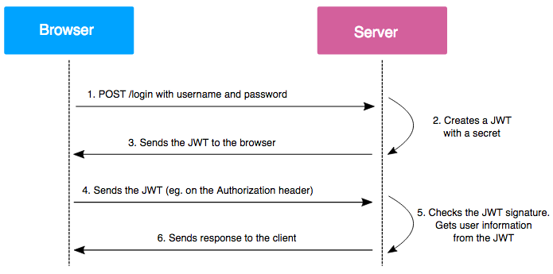

# Software Architecture

The software we designed is based on a client-server architecture that uses the Model-View-Controller (MVC) architectural style:
- **Controller and Model** are managed by the backend, which abstracts and manipulates the data in the database and handles authenticated and non-authenticated HTTP requests. This functionality is achieved using a stack composed of [Apache](https://httpd.apache.org/) - [Laravel](https://laravel.com/) - [PostgreSQL](https://www.postgresql.org/).
- **View** is handled by the frontend using the React JavaScript framework.

The idea was to create a service-oriented architecture to handle various requests (authentication, statistical calculations, user data, stock data, etc.). However, currently, it is more monolithic as it is entirely managed by a single server for simplicity. Nevertheless, the project is developed with the idea of future microservice division, resulting in low coupling between modules.

## Static View
Client-server viewpoint and decomposition

## Deployment Viewpoint

## Security
To access protected endpoints, the client must possess a [JSON Web Token (JWT)](https://jwt.io/) provided during authentication. It guarantees that the user is who they claim to be and has the necessary permissions. For more information, refer to the [RFC 7519](https://tools.ietf.org/html/rfc7519) document.

The token is used both on the client-side and server-side. On the client-side, it is used to determine whether the user has access to certain pages and/or resources. On the server-side, it is used to accept or reject authenticated requests and check if the user has permissions to view and/or modify certain resources.

## Docker
To facilitate software development and future deployment, we decided to use containers through the Docker tool.

The specifications for each container are described in the [docker-compose.yml](../../backend/docker-compose.yml) file. Here's a brief description of the most important ones:
- `sail-8.1/app` contains the Laravel framework and PHP 8.1.
- `postgres:15.1-alpine` contains PostgreSQL.
- `frontend` contains the React framework.

This design choice allows for simplified software releases, such as on [Amazon Elastic Container Service](https://aws.amazon.com/ecs/) or [Azure Container Instances](https://azure.microsoft.com/products/container-instances), without the need to manage the server while maintaining a high degree of scalability.

