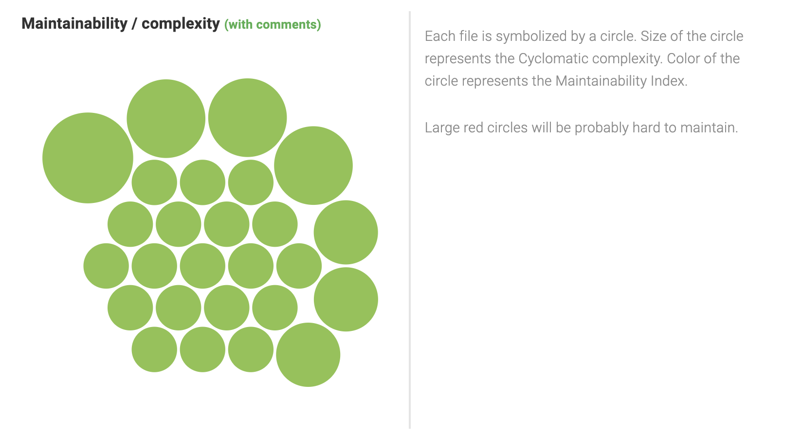
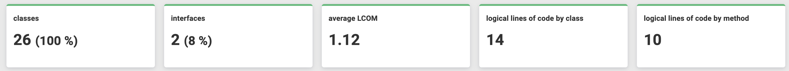

# Software Design

The project operates on a stack composed of [Apache](https://httpd.apache.org/) - [Laravel](https://laravel.com/) - [PostgreSQL](https://www.postgresql.org/) - [React](https://reactjs.org/) following the [MVC](https://en.wikipedia.org/wiki/Model%E2%80%93view%E2%80%93controller) paradigm.

Data management, APIs, and logic are handled by the backend, consisting of Dockerized Apache, Laravel, and PostgreSQL using a tool called [Laravel Sail](https://laravel.com/docs/9.x/sail) provided by Laravel.

The data visualization and user interaction are handled by the React framework, which relies on the endpoints provided by the backend ([API documentation](../API/)).

## PhpMetrics
To perform various complexity calculations and code measurements, we opted to use the measurement tool [PhpMetrics](https://www.phpmetrics.org/).

The results of these measurements and calculations can be found in the subdirectory `Report`. For a complete view, we recommend referring to the entire report. Here, we present some explanatory charts of the various measurements.

### Coupling

### Maintainability

### OOP Metrics

## Design Patterns
Within the Laravel framework, there are multiple design patterns utilized, including:
- Builder pattern
- Factory pattern
- Strategy pattern
- Provider pattern
- Repository pattern
- Facade pattern

The ones we mainly leverage are the Factory pattern for data generation and the Facade pattern for authentication.

