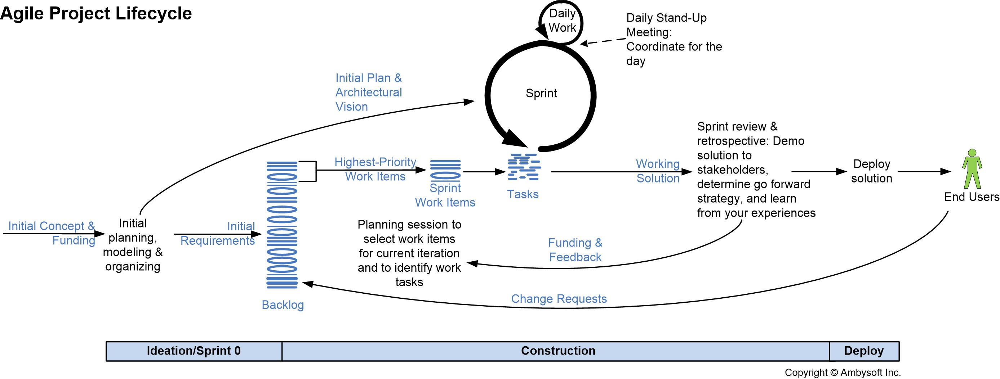

# Software Life Cycle

**For the development process, the team has chosen an Agile approach to have a faster response to changes and not be tied to a rigid plan.**

## SCRUM LIFE CYCLE
For software development, we followed the **SCRUM** life cycle. Initially, after defining all the project requirements, we created a **product backlog** with all the features to be implemented. For each **sprint**, we then selected some of these features (in order of priority) into a sprint backlog and focused on implementing and testing them. The team had daily updates in the **Daily Scrum** and, as needed, we held **Sprint meetings**. At the end of each sprint, which lasted about 4 weeks, the team gathered for the sprint review.

## Agile Method
The guidelines of the Agile method that guided the development of our project are:
- The **team** and its members are crucial, and harmony and coordination must be preserved. Each member contributes their knowledge to solve real problems.
- We focus more on implementing sprint features and **programming rather than documentation**. At the end of each sprint, all new features are functional and ready for implementation.
- The team adapts to **changes** flexibly. If the **client** makes requests during implementation or even after the requirements have been defined, we strive to accommodate them while being mindful of the progress made so far.

## Team Organization
- Although there is a clear division of tasks, there is no strong specialization. If there is a problem, we try to solve it together, regardless of whether it's related to the backend or frontend.
- The Scrum Master changes for each sprint. Whoever takes on the role of the Scrum Master acts as a "coach" and helps motivate the team.
- We use pair programming: for the development of both the frontend and backend, developers have the opportunity to work in pairs. One writes the code while the other acts as a supervisor and reviewer; they can switch roles.

